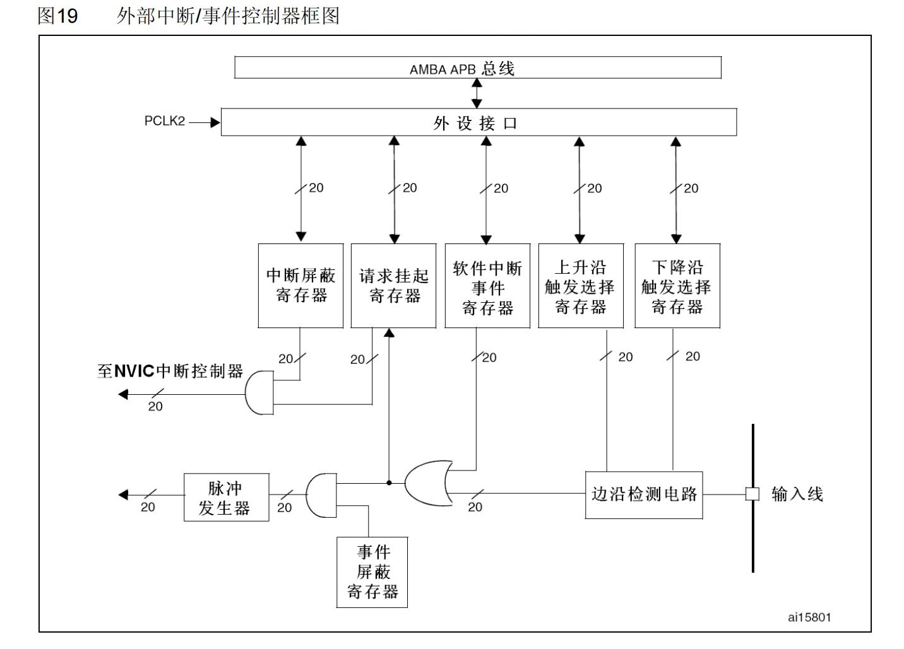

#### RCC：
RCC外设，即复位和时钟控制
1.系统复位
2.电源复位
3.备份域复位
#### 时钟：
高速内部时钟（HSI），高速外部时钟（HSE）,锁相环频时钟（PLL），低速外部时钟（LSE）。
对于STM32上的时钟，更具需求配置。时钟频率选取越高功耗也会越高，另一方面还要考虑芯片的工作条件。
#### 中断
中断优先级：分为可编程和不可编程，决定内核优先响应谁的中断请求。
中断的优先级：抢占级（抢占优先级 高抢占优先级可以打断正在执行的低抢占级），子优先级（如果抢占优先级相同，子优先级高的先行，不能互相打断），抢占优先级和子优先级相同时，自然优先级高的先执行。
NVIC(嵌套向量中断控制器)：256个
STM32F103中用到了4位（共8位），这四位可以配置
EXTI扩展中断和时间控制器：
是STM32上的一个外设，可以捕获外部输入线电平变化的一些事件。
可以通过外部触发和软件触发

**两个功能：** 1. 捕获外部输入 2. 生成EXTI中断请求

  
#### 系统时钟定时器(SysTick)

计数器的工作模式:
向下递减，直到自动重装载计数器的值减到0，触发中断，以此循环。

计数器的工作周期：
1/CLKSource,1/72Mhz
Hal_Delay()就是基于系统时钟实现的

#### 通讯的基本概念
- 串行和并行
  
- 全双工，半双工，单工
  
- 同步和异步
- 通讯速率

#### USART(通用异步收发传输器)外设
- rs232标准传输协议
  波特率，起始位和终止位，有效数据，校验位
波特率设置(F1)：fclk/(16*USARTDIV)

#### 存储器
- (掉电)易失性存储器(RAM)：
  - DRAM:SDRAM,DDR SDRAM,DDRII SDRAM.
  - SRAM
- 非易失性存储器：
  - ROM：
    - MASK ROM
    - PROM:EPROM,EEPROM
  - FLASH:NOR FLASH,NAND FLASH
  - 光盘
  - 机械硬盘
  - 软盘
  